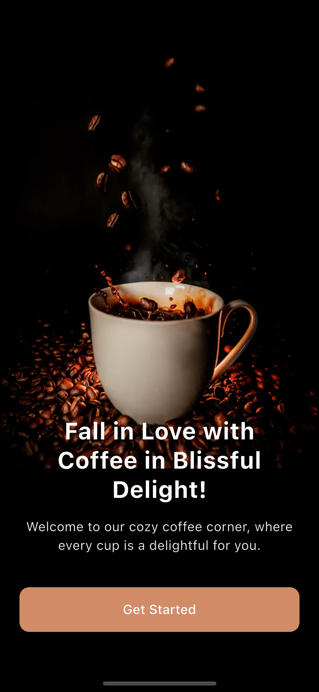
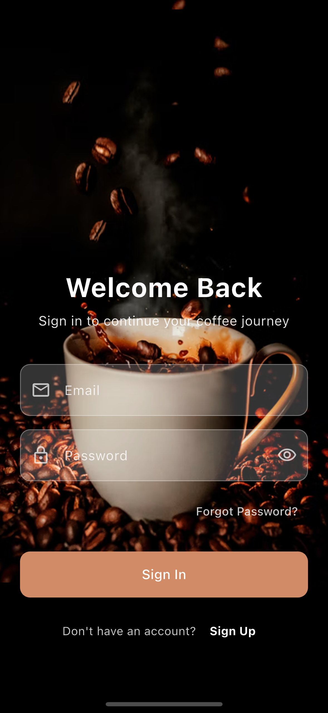
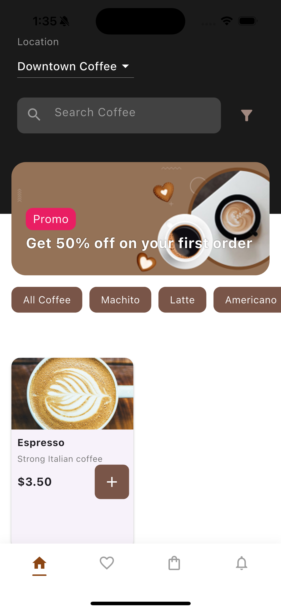
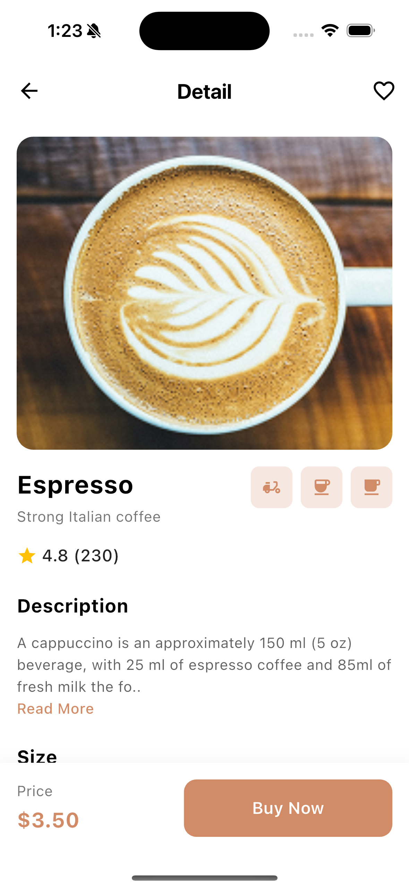
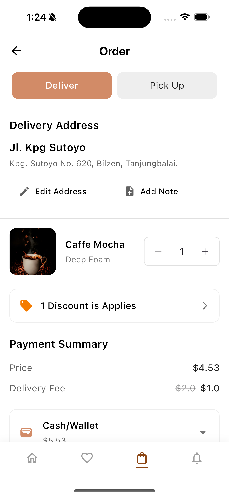

 - The app connects to the Vapor backend API

## Screenshots

Screenshots of the application can be found in the `screenshots/` folder.

### Onboarding Screen

### Login Screen

### Home Screen

### Detail Screen

### Order Screen

## Backend Integration

The app connects to the Vapor backend API running on `http://localhost:8080`
